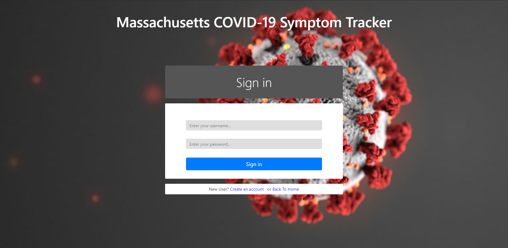

# Team Phi
### COVID-19 Symptom Tracker
Spring 2020

### Overview:

We have created an application intended to be used to aid the attempts of tracking the COVID-19 disease. We saw that there was a lack in the ability to effectively test the population for the disease, and many tests went unreported. Our application aims to allow people to submit a form detailing symptoms they have had which they believe to be related to the novel Coronavirus, whether or not they have been officially tested. This information can be used to track milder cases and the extent of the disease. Many of the current online trackers pull their information directly from databases, and we wanted to improve on that.

### Team Members:
| Name            | GitHub         |
|-----------------|----------------|
| Patrick Cleary  | PatrickCleary  |
| Stephen Disario | stephendisario |
| Nathan Duarte   | nduartech      |

### User Interface: 

- Login page:

- Sign up page:

- Home Page:
Includes navigation bar with option for account management, as well as shortcuts to different sections of the home page. Map is displayed at the top of the page.

- Charts:
Two charts displaing information
    - one which shows severity of each symptom in each county. Can be filtered by symptom, and test result.
    - One with submissions per day, filtered by test result and county.
Table consisting of all counties and their positive and negative test results.

- Submission Form:
A form that allows users to submit information about their symptoms, location, age, etc.

### APIs:

| Route                       | Purpose                                                                                                                                        |
|-----------------------------|------------------------------------------------------------------------------------------------------------------------------------------------|
| / (GET)                     | Returns home page                                                                                                                              |
| /login (GET)                | returns login page                                                                                                                             |
| /register (GET)             | returns sign up page.                                                                                                                          |
| /users/newuser (POST)       | Receives: User information (username, password, email) Creates a new user, redirects to submission form. On failure, returns to newuser page.  |
| /users/deleteUser (POST)    | Receives: Currently logged in username Deletes users, returns to home page.                                                                    |
| /users/Auth (POST)          | Receives: Username, Password If valid, sets session to be logged in and returns to the homepage.                                               |
| /symptoms/checkup (GET)     | Receives: Username, Password If valid credentials renders submission form, with previously collected data, to be updated.                      |
| /symptoms/update (POST)     | Receives: Username, Password If valid credentials, sends update submission information to database to be saved.                                |
| /symptoms/caseFilter (POST) | Receives: Test value (positive/ negative/ NA), County value Returns: Data containing submission forms matching criteria input                  |
| /symptoms/filter (POST)     | Receives: Symptom Value Returns data of patients who experience the selected symptom                                                           |
| /symptoms/all (POST)        | Returns all patient Symptom data.                                                                                                              |

### Database: 

Two tables, Users, and Symptoms. Every User object has a corresponding Symptom Object and vice versa.

User table:

 {
    __id: object ID
    username: string,
    email: string,
    password: string,
    tested: boolean,
    testedResult: integer,
    symptom: Symptom Object ID,
    sex: string,
    county: String,
    age: integer,
    date: Date
  }

  Symptoms table:
    {
        user: User object ID,
        fever: integer,
        tiredness: integer,
        chills: integer,
        digestion: integer,
        smell: integer,
        congestion: integer,
        cough: integer,
        breathing: integer,
        date: integer,
    }

### URL Routes/Mappings:
- / homepage
- /login login page
- /register sign up page
- /form form submission page (only available if logged in)

### Authentication/Authorization:

Any user can create an account and submit a symptom form. That form is private to them, and if they view the submission form after submitting it they will see their own symptoms and can update the form.
Once logged in users have options to log out, and delete their account. Those options appear in the navbar. Other than that the home page looks similar for all users authenticated or otherwise.

### Division of labor:
Patrick: CSS and HTML work on all pages, Map on homepage, routes for map, API and routes for user deletion
Stephen: CSS and HTML work on all pages, Charts and tables on homepage, API and routes for charts, tables, etc.
Nathan: CSS and HTML work on all pages, Helped with all aspects of front end, designed and implemented database, and structure of backend.

Conclusion: A conclusion describing your team’s experience in working on this project. This should include what you learned through the design and implementation process, the difficulties you encountered, what your team would have liked to know before starting the project that would have helped you later, and any other technical hurdles that your team encountered.