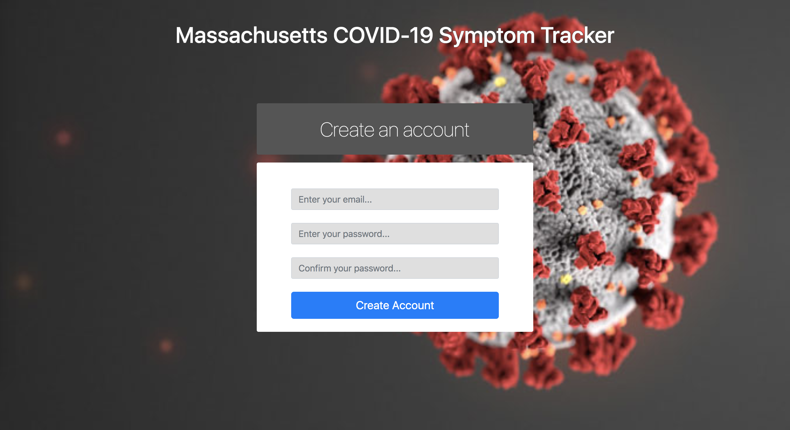
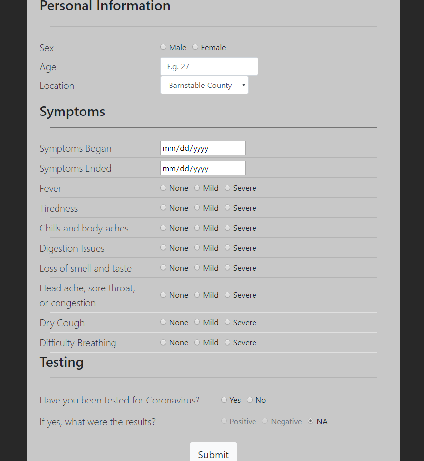

# Milestone 1:

### Data Interactions:
- Users will be able to select certain variables to view graphs/charts pertaining to their selection.
    - E.g. choose to view graph that displays new cases per day over time
    - E.g. choose to view a graph that looks at how many cases there are per age group
- Users will be able to see chart data change based on what day the have the slider on the bottom set to.
    - E.g. If they set the slider to day 10, the chart will display the active, confirmed, death, and recovery valuesfrom day 10 in each county
- Users can submit a symptoms form that will allow us to obtain more data related to the virus
- Users will be able to create an account and sign in, users must be signed in to submit a symptoms form.
- Future Goal: Users can see data for multiple states and have the option to jump from state to state.
- Future Goal: The map of the state will be interactive, areas with a lot of cases will be marked darker.
### Wireframes:
Log in page:

Sign up page:

Home page:

Form submission Page:

### HTML and CSS screenshots:

Login page:

Sign up page:

Home page:

Form submission page:

### Contributions:
Stephen:
- Created the symptoms form page
- Created the first version of the Log In Page (later aesthetic/layout changes were made)
- Created the first version of the Sign Up Page (later aesthetic/layout changes were made)

Patrick
- Set up project, initial files, and file structure
- Worked on style and html on all of the pages.

Nathan:
- Created initial dashboard/main page (home.html).
