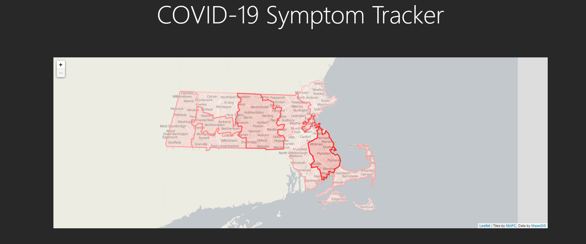
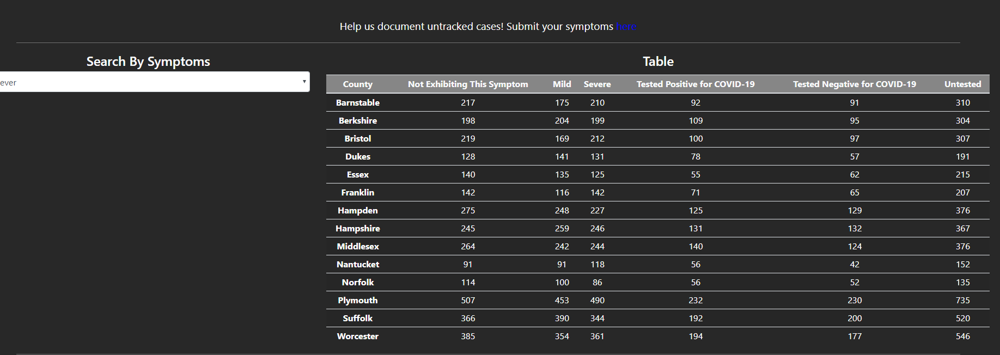

# Milestone 2

### APIs:

- user creation
- symptom submission
- symptom retrieval to create maps and charts
- Form submission currently only works with test username: 'sample'

### Screenshots:

Heat map of Massachusetts counties
     

Table representing information about the selected symptom
       

Charts representing severity of symptoms for each county given selected symptom
       

Phone screen size, with all parts on the page

### URL:
https://arcane-bayou-18470.herokuapp.com

### Contributions

Nathan: Back end, routing
Stephen: Table, Charts, symptom routes, the entirety of node_modules (whoops) 
Patrick: Maps, heroku, mongodb and fake data setup